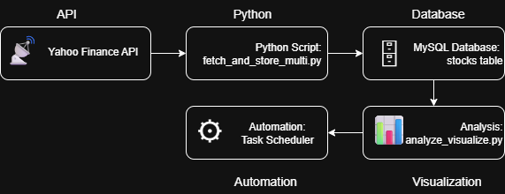
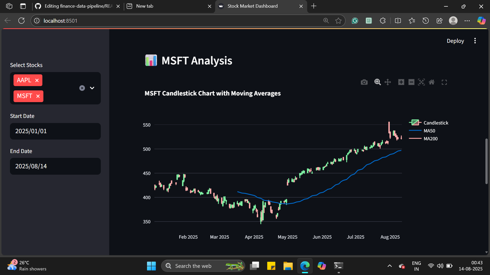

# finance-data-pipeline
Automated stock data pipeline with real-time analytics and dashboard : Automated stock market data pipeline using Python, MySQL, and Streamlit. Fetches live stock data from Yahoo Finance, stores it in MySQL, analyzes &amp; visualizes trends, and provides a real-time dashboard. Includes automation with Windows Task Scheduler for daily updates.
# 📊 Finance Data Pipeline

A fully automated **Finance Data Pipeline** that fetches historical stock data from **Yahoo Finance**, stores it in **MySQL**, and provides interactive analysis & visualizations via **Streamlit**.

---

## 🚀 Features
- Fetch historical stock prices from **Yahoo Finance** using `yfinance`.
- Store data in **MySQL** with duplicate prevention (upsert).
- Support for **multiple tickers** with incremental updates.
- Data **analysis & visualization** using Pandas, Matplotlib, and Seaborn.
- **Streamlit dashboard** for interactive viewing.
- Optional integration with **AWS S3** for data warehousing.
- **Automated daily updates** via Windows Task Scheduler.

---

## 📂 Project Structure

finance-data-pipeline/
- │
- ├── venv/ # Python virtual environment (not pushed to GitHub)
- │
- ├── .env # Database credentials & secrets (ignored in .gitignore)
- ├── .gitignore # Ignore venv/, pycache/, and .env
- ├── README.md # Project documentation
- │
- ├── db_connect.py # MySQL connection test script
- ├── fetch_and_store.py # Fetch & store data for a single ticker
- ├── fetch_and_store_multi.py # Fetch & store data for multiple tickers
- ├── fetch_yfinance.py # Basic Yahoo Finance fetch script
- ├── ticker_list.py # List of stock tickers
- ├── analyze_visualize.py # Data analysis & visualization script
- ├── dashboard.py # Streamlit dashboard
- │
- ├── pipeline.png # Data pipeline diagram
- │
- └── requirements.txt # Python dependencies

yaml
---

## 🛠️ Setup & Installation

### 1️⃣ Clone the Repository
```bash
git clone https://github.com/YOUR-USERNAME/finance-data-pipeline.git
cd finance-data-pipeline
```
2️⃣ Create a Virtual Environment
```bash
python -m venv venv
venv\Scripts\activate   # Windows
# or
source venv/bin/activate  # Mac/Linux
```
3️⃣ Install Dependencies
```bash
pip install -r requirements.txt
```
4️⃣ Configure .env File
Create a .env file in the project root:
```env
DB_HOST=localhost
DB_USER=root
DB_PASSWORD=yourpassword
DB_NAME=finance_data
```
⚡ Usage
Fetch Data for Single Ticker
```bash
python fetch_and_store.py
```
Fetch Data for Multiple Tickers
```bash
python fetch_and_store_multi.py
```
Run Analysis Script
```bash
python analyze_visualize.py
```
Launch Streamlit Dashboard
```bash
streamlit run dashboard.py
```
📈 Example Pipeline Diagram


📅 Automation (Windows Task Scheduler)
- Open Task Scheduler → Create Task.
- Set a daily trigger.
- In Actions, run:
```bash
python path\to\fetch_and_store_multi.py
```

🌐 Optional: AWS S3 Integration
You can push cleaned data to AWS S3 for cloud storage:
- Install AWS CLI → pip install awscli
- Configure → aws configure
- Upload:

```bash
aws s3 cp data.csv s3://your-bucket-name/
```
Sample Dashboard: 



- 📜 License
This project is licensed under the MIT License.
